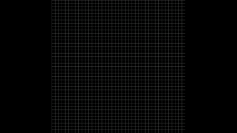
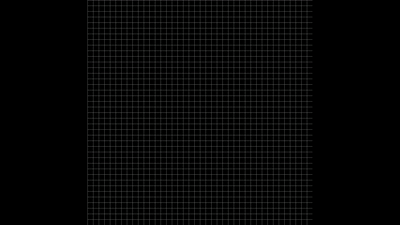
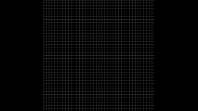
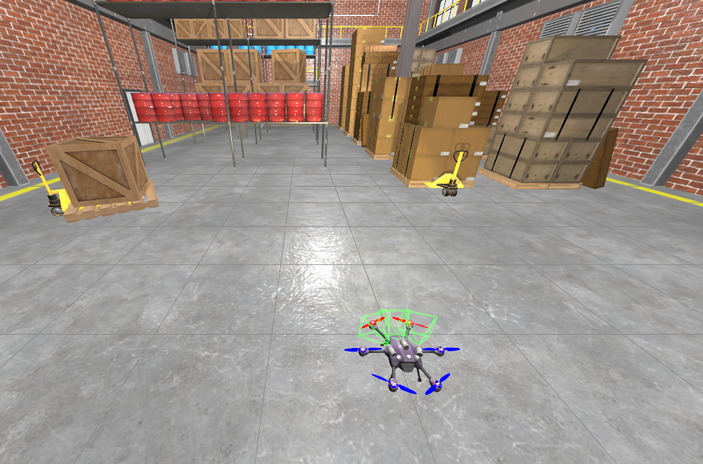

# Path Planning and Drone Navigation with A*

## Overview

This repository implements a grid-based algorithm (i.e. **A***) as well as a simple simulation pipeline for navigation. The code can be extended for real-world deployment, once provided with a proper perception and SLAM modules.  

---


## Requirements

| Dependency     | Minimum Version | Notes |
|----------------|----------------|-------|
| **C++ Compiler** | 11.4.0         | Tested with GCC 11.4 on Ubuntu 22.04. Supports C++17. |
| **CMake**       | 3.22.1         | Used for build configuration. |
| **OpenCV**      | 4.13.0         | Required for visualization |


---

## 1. A* Path Planning

### Advantages
- Guarantees the shortest path in a discretized grid when the heuristic is admissible.
- Simple to implement and understand.
- Works well for static maps with known obstacles.

### Limitations
- Computational cost increases rapidly with grid size.
- Sensitive to resolution: coarse grids may yield suboptimal paths.
- Does not handle dynamic obstacles or continuous state spaces.
- Requires additional smoothing for realistic robot/drone trajectories.

---

## 2. Evolution to Real Drone Deployment

To deploy on a real drone, several additional components are required:

1. **SLAM (Simultaneous Localization and Mapping)**  
   - Provides a **metric map** and estimates the drone's pose in real-time.
   - Replaces the simulated occupancy grid used in offline planning.

2. **Control Layer**  
   - Converts planned trajectories into motor commands.  
   - Common approaches:  
     - **PID** controllers for basic stabilization and waypoint following.  
     - **MPC (Model Predictive Control)** for trajectory tracking under constraints.

The pipeline becomes: **SLAM → Planner (A*, RRT, etc.) → Trajectory smoothing → Controller (PID/MPC)**.

---

## 3. Vision Pipeline on Jetson Orin

- **GPU acceleration** is leveraged for real-time perception.  
- **CUDA** enables fast image pre-processing and computations.  
- **TensorRT** or **DeepStream SDK** can optimize neural network inference for object detection, semantic segmentation, or depth estimation.  
- Pipeline example:

- Real-time constraints require careful memory management and batch processing to sustain high frame rates.

---

## 4. GigE Vision Concepts

For high-resolution cameras over Ethernet (GigE Vision):

- **Jumbo Frames**  
- Frames larger than the standard Ethernet MTU (usually 1500 bytes).  
- Reduces overhead and increases throughput for large images.

- **MTU (Maximum Transmission Unit)**  
- Defines the largest packet size allowed on the network.  
- Proper MTU configuration avoids fragmentation and packet loss.

- **Buffers**  
- Multiple buffers allow the camera to store several frames in memory before the host reads them.  
- Crucial for high frame rates, preventing dropped frames and ensuring smooth acquisition.

---

## Quick Start

```bash
# Clone repository
git clone https://github.com/notyriuss/path_planning.git
cd path_planning

# Build project
mkdir build && cd build
cmake ..
make

# Run simulation
./path_planning
```

---

## Demonstrations

Current pipeline demonstrations.  

<p float="left">
  
  
  
  
</p>

---

## TODO

Future work includes implementing full navigation using **ROS2** and simulating the drone in **Gazebo** for more realistic scenarios.  


